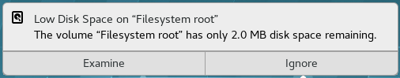
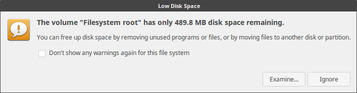

# Speeding up the boot process
Run `DisableUnnecessaryServices.sh` to disable `NetworkManager-wait-online.service` , `plymouth-quit-wait.service` , `ModemManager.service` , `ofono.service` & `dundee.service` (IF ofono is installed). Instead of disabling `plymouth-quit-wait.service`, it's even better to purge plymouth with `sudo apt-get purge plymouth`

Remove `splash` in this line in `/etc/default/grub` and add `usbcore.autosuspend=-1` to make the mic in the USB Web Cam work. i.e.

`#GRUB_CMDLINE_LINUX_DEFAULT="quiet splash"` to `GRUB_CMDLINE_LINUX_DEFAULT="quiet usbcore.autosuspend=-1"`and run `sudo update-grub`

## udisks2 raid warnings

Check if there are any warnings (or error messages) from udisks2 about raid (such as here https://bugs.launchpad.net/ubuntu/+source/udisks2/+bug/1811724) by executing

 `journalctl -b | grep udisks` or `sudo systemctl status udisks2`

If there are messages like "failed to load module mdraid: libbd_mdraid.so.2: cannot open shared object file: No such file or directory" or "Failed to load the 'mdraid' libblockdev plugin", then install the 2 missing packages
 
`sudo apt-get install libblockdev-crypto2 libblockdev-mdraid2`
 
Restart udisks2 and check its status to see if the warnings are gone
 
`sudo systemctl restart udisks2`
 
`journalctl -b | grep udisks` or `sudo systemctl status udisks2`

## blueman prompt / error requiring every user to authenticate with sudo privilleges upon login

View `blueman.rules` with

`cat /usr/share/polkit-1/rules.d/blueman.rules`

```
// Allow users in sudo or netdev group to use blueman feature requiring root without authentication
polkit.addRule(function(action, subject) {
    if ((action.id == "org.blueman.network.setup" ||
         action.id == "org.blueman.dhcp.client" ||
         action.id == "org.blueman.rfkill.setstate" ||
         action.id == "org.blueman.pppd.pppconnect") &&
        subject.local && subject.active &&
        (subject.isInGroup("sudo") || subject.isInGroup("netdev"))) {
        return polkit.Result.YES;
    }
});

```

Confirm if the logged in user belongs to `netdev` group by executing 

`groups`

If not, include them in `netdev` group by executing

`sudo gpasswd -a ${USER} netdev` and check again by executing `groups`

### blueman gtk_icon_theme_get_for_screen warnings
1. Check for "gtk_icon_theme_get_for_screen: assertion 'GDK_IS_SCREEN (screen)' failed". Note: The service might have already failed to start. `systemctl status blueman-mechanism.service`
2. Stop if "gtk_icon_theme_get_for_screen: assertion 'GDK_IS_SCREEN (screen)' failed" is present `sudo systemctl stop blueman-mechanism.service`
3. Disable blueman-mechanism.service. Note: The service will still try to start and give the same error. But it will not hold up the boot process like before.
 `sudo systemctl disable blueman-mechanism.service` 

## Allow multicast incoming pings / packets from your router if you use UFW

Add the following rule where `192.168.254.1` is an example of your router's IP address

`sudo ufw allow in from 192.168.254.1 to 224.0.0.0/24` - Refer - https://bbs.archlinux.org/viewtopic.php?id=212452 or https://forums.linuxmint.com/viewtopic.php?t=111630

Then reload the firewall

`sudo ufw reload`

and check the status

`sudo ufw status verbose`


## Create common mount points for partitions commonly accessed by all users and include them in fstab.
This will help in avoiding warnings in `journalctl -u udisks2` whenever a super user who mounted these partitions re-boots as these warning rould appear as the boot process tries to re-mount those partition with the <username> in their path and it cannot do it as the user is not logged in yet. This warning will look like `udisksd[695]: mountpoint /media/<username>/<partition-name> is invalid, cannot recover the canonical path`
 
`sudo mkdir /media/all-users-<partition-name>` creates a common mount point for all users

`sudo blkid | grep UUID=` gets the UUID of those partitions

`sudo nano /etc/fstab` opens fstab to put the mount point against the UUID
 
 ```
# The below line is added so that the path to the CommonData partition is common for all users
# Change between auto and noauto based on whether to mount this partition automatically at boot
UUID=99999999-9999-9999-9999-999999999999 /media/all-users-<partition-name> ext4 noauto,nosuid,nodev,noexec,nouser,nofail 0 0
```
`sudo mount -a # Check if the mount points are good per the edits made in fstab`

## Remove snapd

[Instructions to remove snapd](Removing-snapd.md)
 
### Install firefox from PPA

[Instructions to install firefox from PPA](Firefox-from-PPA.md)
 

## Only for Dell Inspiron 1720 with NVIDIA G86M [GeForce 840M GS] Graphics card

[Handling NVIDIA G86M on Dell Inspiron 1720](Inspiron-1720-NVIDIA-G86M.md)
 
 
## Only for Dell Inspiron 3542 
[Dell Inspiron 3542](Inspiron-3542.md)

 
 
# Regular Cleanup
Periodically run the `CleanCacheAndLogs.sh` as root if you have low root disk space popup appearing in ubuntu (Unity) or gnome. See example images for these pop-up.
Not having enough space for root may even stop your system from booting up (will not load X)




