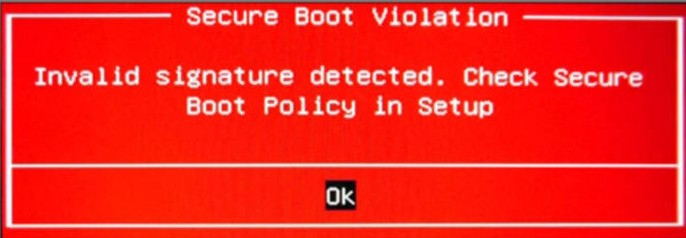

# Speeding up the boot process
Run `DisableUnnecessaryServices.sh` to disable `NetworkManager-wait-online.service` , `plymouth-quit-wait.service` , `ModemManager.service` , `ofono.service` & `dundee.service` (IF ofono is installed). Instead of disabling `plymouth-quit-wait.service`, it's even better to purge plymouth with `sudo apt-get purge plymouth`

Remove `splash` in this line in `/etc/default/grub` and add `usbcore.autosuspend=-1` to make the mic in the USB Web Cam work. i.e.

`#GRUB_CMDLINE_LINUX_DEFAULT="quiet splash"` to `GRUB_CMDLINE_LINUX_DEFAULT="quiet usbcore.autosuspend=-1"`and run `sudo update-grub`

## udisks2 raid warnings

Check if there are any warnings (or error messages) from udisks2 about raid (such as here https://bugs.launchpad.net/ubuntu/+source/udisks2/+bug/1811724) by executing

 `journalctl -b | grep udisks` or `sudo systemctl status udisks2`

If there are messages like "failed to load module mdraid: libbd_mdraid.so.2: cannot open shared object file: No such file or directory" or "Failed to load the 'mdraid' libblockdev plugin", then install the 2 missing packages
 
`sudo apt-get install libblockdev-crypto2 libblockdev-mdraid2`
 
Restart udisks2 and check its status to see if the warnings are gone
 
`sudo systemctl restart udisks2`
 
`journalctl -b | grep udisks` or `sudo systemctl status udisks2`

## blueman prompt / error requiring every user to authenticate with sudo privilleges upon login

View `blueman.rules` with

`cat /usr/share/polkit-1/rules.d/blueman.rules`

```
// Allow users in sudo or netdev group to use blueman feature requiring root without authentication
polkit.addRule(function(action, subject) {
    if ((action.id == "org.blueman.network.setup" ||
         action.id == "org.blueman.dhcp.client" ||
         action.id == "org.blueman.rfkill.setstate" ||
         action.id == "org.blueman.pppd.pppconnect") &&
        subject.local && subject.active &&
        (subject.isInGroup("sudo") || subject.isInGroup("netdev"))) {
        return polkit.Result.YES;
    }
});

```

Confirm if the logged in user belongs to `netdev` group by executing 

`groups`

If not, include them in `netdev` group by executing

`sudo gpasswd -a ${USER} netdev` and check again by executing `groups`

### blueman gtk_icon_theme_get_for_screen warnings
1. Check for "gtk_icon_theme_get_for_screen: assertion 'GDK_IS_SCREEN (screen)' failed". Note: The service might have already failed to start. `systemctl status blueman-mechanism.service`
2. Stop if "gtk_icon_theme_get_for_screen: assertion 'GDK_IS_SCREEN (screen)' failed" is present `sudo systemctl stop blueman-mechanism.service`
3. Disable blueman-mechanism.service. Note: The service will still try to start and give the same error. But it will not hold up the boot process like before.
 `sudo systemctl disable blueman-mechanism.service` 

## Allow multicast incoming pings / packets from your router if you use UFW

Add the following rule where `192.168.254.1` is an example of your router's IP address

`sudo ufw allow in from 192.168.254.1 to 224.0.0.0/24` - Refer - https://bbs.archlinux.org/viewtopic.php?id=212452 or https://forums.linuxmint.com/viewtopic.php?t=111630

Then reload the firewall

`sudo ufw reload`

and check the status

`sudo ufw status verbose`


## Create common mount points for partitions commonly accessed by all users and include them in fstab.
This will help in avoiding warnings in `journalctl -u udisks2` whenever a super user who mounted these partitions re-boots as these warning rould appear as the boot process tries to re-mount those partition with the <username> in their path and it cannot do it as the user is not logged in yet. This warning will look like `udisksd[695]: mountpoint /media/<username>/<partition-name> is invalid, cannot recover the canonical path`
 
`sudo mkdir /media/all-users-<partition-name>` creates a common mount point for all users

`sudo blkid | grep UUID=` gets the UUID of those partitions

`sudo nano /etc/fstab` opens fstab to put the mount point against the UUID
 
 ```
# The below line is added so that the path to the CommonData partition is common for all users
# Change between auto and noauto based on whether to mount this partition automatically at boot
UUID=99999999-9999-9999-9999-999999999999 /media/all-users-<partition-name> ext4 noauto,nosuid,nodev,noexec,nouser,nofail 0 0
```
`sudo mount -a # Check if the mount points are good per the edits made in fstab`

## Remove snapd

Refer 

https://ubuntuhandbook.org/index.php/2022/04/remove-snap-block-ubuntu-2204/

https://www.debugpoint.com/remove-snap-ubuntu/
 
https://haydenjames.io/remove-snap-ubuntu-22-04-lts/

https://onlinux.systems/guides/20220524_how-to-disable-and-remove-snap-on-ubuntu-2204
 
### Remove each app installed by snap

List all installed snap applications:

`snap list` - Remember to install these packages as needed after removing snap using deb or apt

Disable snapd services with 

`sudo systemctl disable snapd.service snapd.socket snapd.seeded.service`

Remove packages one by one 
 
`sudo snap remove --purge <each package in the list>`

 For e.g. `sudo snap remove --purge firefox` and `sudo snap remove --purge snap-store`
 
Remove the daemon 

`sudo apt remove --autoremove snapd` or `sudo apt autoremove --purge snapd`

Delete any leftover cache from Snap with

`sudo rm -rf /var/cache/snapd/`

`rm -rf ~/snap`

### Prevent ubuntu from installing snap package again

After completely removing snap packages, set a low priority for the snapd package to prevent Ubuntu from reinstalling it

Create and open a configuration file with `sudo gedit /etc/apt/preferences.d/nosnap.pref`

Paste the following lines in the file to prevent the package installation from any repository:
```
    # Prevent repository packages from triggering the installation of snap,
    # Forbids snapd from being installed by APT by using  Pin-Priority: -10

    Package: snapd
    Pin: release a=*
    Pin-Priority: -10
```
Save the file and refresh package cache with `sudo apt update`
 
### Install firefox from PPA
 
Refer https://www.omgubuntu.co.uk/2022/04/how-to-install-firefox-deb-apt-ubuntu-22-04

`sudo snap remove firefox` 

`sudo add-apt-repository ppa:mozillateam/ppa`
 
Alter the Firefox package priority to ensure the PPA/deb/apt version of Firefox is preferred. This can be done using a slither of code from FosTips (copy and paste it whole, not line by line):
```
echo '
Package: *
Pin: release o=LP-PPA-mozillateam
Pin-Priority: 1001
' | sudo tee /etc/apt/preferences.d/mozilla-firefox
```

Since we want future Firefox upgrades to be installed automatically, Balint Reczey shares a concise command on his blog that ensures it happens:

`echo 'Unattended-Upgrade::Allowed-Origins:: "LP-PPA-mozillateam:${distro_codename}";' | sudo tee /etc/apt/apt.conf.d/51unattended-upgrades-firefox`

Finally, install Firefox via apt by running this command:

`sudo apt install firefox`
 
 

## Only for Dell Inspiron 1720 with NVIDIA G86M [GeForce 840M GS] Graphics card
### Driver Installation error
Install NVIDIA binary driver - vesion 340.108 from nvidia-340 (properitary, tested) from "Additional Drivers" in the GUI. If you get an error as below
``` 
 pk-client-error-quark: The following packages have unmet dependencies:
  nvidia-340: Depends: lib32gcc-s1 but it is not going to be installed
              Depends: libc6-i386 but it is not going to be installed (268)
```
then re-attempt the installation like below from the terminal

`sudo ubuntu-drivers autoinstall`

This will give the same errors as in the GUI, but with the version of the package it is expecting. In this case 2.31-0ubuntu9.2 (For e.g. downgrade from 2.31-0ubuntu9.3). Install those specific version of the package like below.

`sudo apt-get install libc6=2.31-0ubuntu9.2 libc-bin=2.31-0ubuntu9.2`

`sudo apt-get install libc6-i386`
 
And then re-attempt the driver installation

`sudo ubuntu-drivers autoinstall`

`sudo apt-get update`

Reference https://askubuntu.com/questions/1315906/unmet-dependencies-libc6-the-package-system-is-broken

 
### NVRM VGA errors in dmesg
Execute `dmesg | grep NVRM` and see if you get the errors below

```
[   17.214717] NVRM: Your system is not currently configured to drive a VGA console
[   17.214720] NVRM: on the primary VGA device. The NVIDIA Linux graphics driver
[   17.214723] NVRM: requires the use of a text-mode VGA console. Use of other console
[   17.214726] NVRM: drivers including, but not limited to, vesafb, may result in
[   17.214729] NVRM: corruption and stability problems, and is not supported.
```
Then edit the `/etc/default/grub` file and add kernel parameters to the line

`GRUB_CMDLINE_LINUX="video=vesa:off vga=normal"` and execute
 
`sudo update-grub`
 
### Disable NVIDIA Splash screen
 
Execute `sudo nvidia-xconfig --no-logo` to disable NVIDIA Splash screen and `sudo nvidia-xconfig --logo` to enable it back again if needed

## Only for Dell Inspiron 3542 

### MDS CPU Vulnerability
1. `dmesg --level=warn` and check if there is a warning like below
```
[    0.146525] MDS CPU bug present and SMT on, data leak possible. See https://www.kernel.org/doc/html/latest/admin-guide/hw-vuln/mds.html for more details.
```
2. `sudo nano /etc/default/grub` and edit the line `GRUB_CMDLINE_LINUX_DEFAULT="quiet usbcore.autosuspend=-1 mds=full,nosmt"` to have `mds=full,nosmt`
3. `sudo update-grub`, reboot and check `dmesg --level=warn` if the MDS CPU bug warning is gone

### EFI Secure boot
1. `sudo efibootmgr -v` and check if `BootCurrent` shows `0000`, which in turnpoints to `SHIMX64.EFI`. If not change the boot order to SHIMX64.EFI in the BIOS Boot order. Refer [Secure Boot Error: Invalid signature detected. Check secure boot policy in setup](https://askubuntu.com/questions/871179/secure-boot-error-invalid-signature-detected-check-secure-boot-policy-in-setup), [Double Ubuntu entry in BIOS boot options](https://askubuntu.com/questions/840602/double-ubuntu-entry-in-bios-boot-options) 
 
 
```
BootCurrent: 0000
Timeout: 0 seconds
BootOrder: 0000,0001,000C,000B
Boot0000* ubuntu shimx64	HD(1,GPT,d0d091ea-ce94-4f15-8f27-4d9a11007a81,0x800,0xef000)/File(\EFI\UBUNTU\SHIMX64.EFI)
Boot0001* ubuntu grubx64	HD(1,GPT,d0d091ea-ce94-4f15-8f27-4d9a11007a81,0x800,0xef000)/File(\EFI\UBUNTU\GRUBX64.EFI)
Boot000B* Onboard NIC(IPV4)	PciRoot(0x0)/Pci(0x1c,0x3)/Pci(0x0,0x0)/MAC(b82a72c2b8f3,0)/IPv4(0.0.0.00.0.0.0,0,0)..BO
Boot000C* Onboard NIC(IPV6)	PciRoot(0x0)/Pci(0x1c,0x3)/Pci(0x0,0x0)/MAC(b82a72c2b8f3,0)/IPv6([::]:<->[::]:,0,0)..BO

```
It may be required to go over this step a couple of times if a red message on "Secure Boot Violation" appears soon after BIOS Flash like below


 
 
# Regular Cleanup
Periodically run the `CleanCacheAndLogs.sh` as root if you have low root disk space popup appearing in ubuntu (Unity) or gnome. See example images for these pop-up.
Not having enough space for root may even stop your system from booting up (will not load X)


